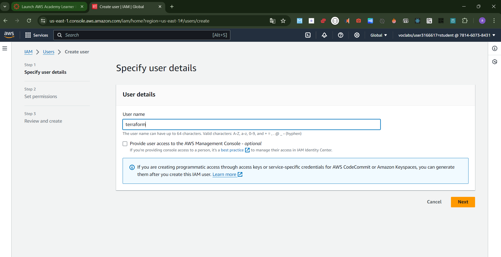
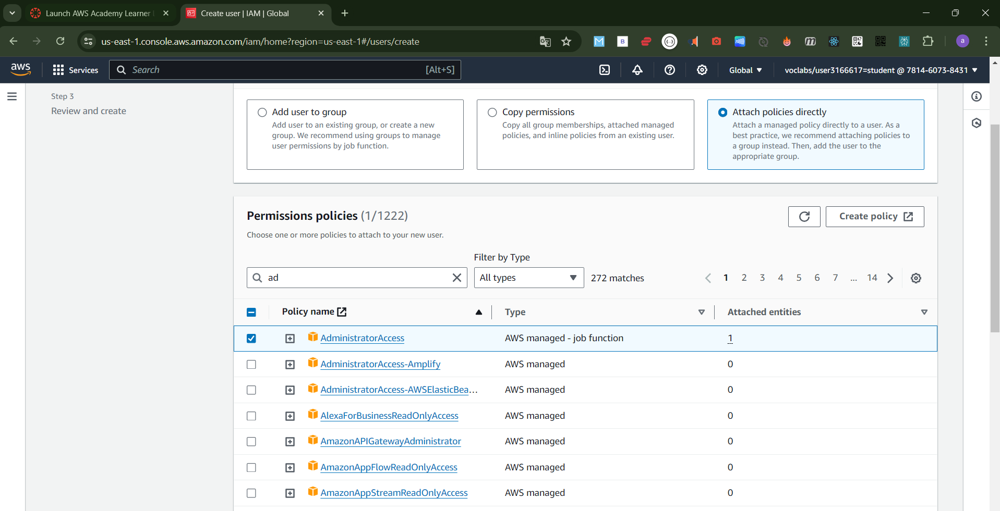

## Prepare Terraform Environment on Windows
As part of this, we should set up:
1. Terraform
2. VS Code
3. AWSCLI

---

## Introduction
This guide covers the setup of a Terraform environment on Windows, including the installation of necessary tools and writing your first Terraform file to create AWS resources.

---

## Prerequisites

### 1. Terraform
- **Definition:** An open-source infrastructure as code tool by HashiCorp.
- **Purpose:** Automates the creation and management of infrastructure using configuration files.

### 2. Visual Studio Code (VS Code)
- **Definition:** A free, open-source code editor by Microsoft.
- **Purpose:** Provides a powerful coding environment with extensions for Terraform and other DevOps tools.

### 3. AWS Command Line Interface (AWSCLI)
- **Definition:** A unified tool to manage AWS services from the command line.
- **Purpose:** Facilitates the automation and management of AWS resources.

---

## Installation Steps

### Install Terraform
1. **Download:** Get the latest version from the [Terraform website](https://www.terraform.io/downloads.html).
2. **Setup Environment Variable:**
   - Add Terraform to the system `Path` variable:
     ```plaintext
     C:\Program Files\terraform_1.3.7
     ```
   - Validate installation with:
     ```sh
     terraform -version
     ```

### Install Visual Studio Code
1. **Download and Install:** Get the latest version from the [VS Code website](https://code.visualstudio.com/Download).

### Install AWSCLI
1. **Download and Install:** Get the latest version from the [AWSCLI website](https://aws.amazon.com/cli/).
2. **Alternative Installation:**
   - Use PowerShell or Command Prompt:
     ```sh
     msiexec.exe /i https://awscli.amazonaws.com/AWSCLIV2.msi
     ```

---

## Setting Up AWS

### 1. Create IAM User in AWS


### 2. Assign Permissions to the User


### 3. Configure AWSCLI


---

## Writing Your First Terraform File

### 1. Provider Block
- **Definition:** Specifies the cloud provider for Terraform.
- **Purpose:** Configures Terraform to manage resources on the chosen provider.
- **Example:**
  ```hcl
  provider "aws" {
    project = "acme-app"
    region  = "us-central1"
  }
  ```


### 2. Resource Block
- **Definition:** Defines infrastructure objects managed by Terraform.
- **Purpose:** Specifies the components to be created, configured, or managed.
- **Example (EC2 Instance):**
  ```hcl
  resource "aws_instance" "web" {
    ami           = "ami-a1b2c3d4"
    instance_type = "t2.micro"
    keypair       = "demo_key"
  }
  ```

---

## Creating a VPC and EC2 Instance


### 1. VPC (Virtual Private Cloud)
- **Definition:** A virtual network dedicated to your AWS account.
- **Purpose:** Provides control over your virtual networking environment.
- **Example:**
  ```hcl
  resource "aws_vpc" "dpw-vpc" {
    cidr_block = "10.1.0.0/16"
    tags = {
      Name = "dpw-vpc"
    }
  }
  ```

### 2. Subnet
- **Definition:** A range of IP addresses in your VPC.
- **Purpose:** Allows partitioning of the VPC's IP address range.
- **Example:**
  ```hcl
  resource "aws_subnet" "dpw-public_subnet_01" {
    vpc_id = aws_vpc.dpw-vpc.id
    cidr_block = "10.1.1.0/24"
    map_public_ip_on_launch = true
    availability_zone = "us-east-1a"
    tags = {
      Name = "dpw-public_subnet_01"
    }
  }
  ```

### 3. Internet Gateway
- **Definition:** Allows communication between instances in your VPC and the internet.
- **Purpose:** Enables internet access for instances within the VPC.
- **Example:**
  ```hcl
  resource "aws_internet_gateway" "dpw-igw" {
    vpc_id = aws_vpc.dpw-vpc.id
    tags = {
      Name = "dpw-igw"
    }
  }
  ```

### 4. Route Table
- **Definition:** Contains rules that determine where network traffic is directed.
- **Purpose:** Manages routing within the VPC and to external networks.
- **Example:**
  ```hcl
  resource "aws_route_table" "dpw-public-rt" {
    vpc_id = aws_vpc.dpw-vpc.id
    route {
      cidr_block = "0.0.0.0/0"
      gateway_id = aws_internet_gateway.dpw-igw.id
    }
    tags = {
      Name = "dpw-public-rt"
    }
  }
  ```

### 5. Route Table Association
- **Definition:** Associates a route table with a subnet.
- **Purpose:** Ensures the subnet follows the defined routing rules.
- **Example:**
  ```hcl
  resource "aws_route_table_association" "dpw-rta-public-subnet-1" {
    subnet_id = aws_subnet.dpw-public_subnet_01.id
    route_table_id = aws_route_table.dpw-public-rt.id
  }
  ```

---

## Advanced Usage

### Using `for_each` in Terraform
- **Definition:** A construct that allows looping over a set of values to create multiple instances of a resource.
- **Purpose:** Reduces repetitive code by dynamically creating resources based on a list or map of values.
- **Example:**
  ```hcl
  resource "aws_instance" "example" {
    for_each = toset(["master", "slave"])
    ami           = "ami-a1b2c3d4"
    instance_type = "t2.micro"
    keypair       = "demo_key"
    tags = {
      Name = each.key
    }
  }
  ```
### 4. terraform init


### 5. terraform plan


### 6. terraform apply


### 6. terraform workning

---
+++
